# MÜZİK UYGULAMASI

Bu projede müzik uygulaması yaptık. Uygulamada Apı kullanmadan kendimiz sınıf tanımlayarak oluşturduk. 

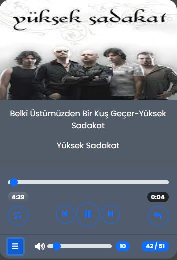

## Müzik Uygulaması Tasarımı;

Uygulamayı tasarlarken container classı içinde oluşturuyoruz. Container oluştururken  body etiketine display:flex,align-items:center,justify-content:center classlarını vererek containerı sayfanın ortasına taşıyoruz.

```css
body{
    font-family:"Poppins", sans-serif; ;
    display: flex;
    align-items: center;
    justify-content: center;
    height: 100vh;
    background: rgba(0,0,0,.72);
}

.container{
    border-radius: 20px;
    width: 380px;
    position: relative;
    box-shadow: 0 px 8px 14px var(--lightbshadow);
}
```

Container classıma relative ve width classrını vererek containerin boyutunu ve sayfadaki pozisyonunu ayarladık. Container'ın altında bir card oluşturduk. Bu card içinde çalan müziğin resmi, çalan müzik, müziğin başlığı ve söyleyen şarkıcı ismini bu card içine yerleştirdik. Çalan müziğin resmini card-img-top classı içine yerleştirdik. audio etiket içinede müziği yerleştirdik(Mavi renkteki dikdörtgen içinde). Music-deatils id'si altında p etiketleri oluşturarak çalan şarkının başlığı ve söyleyen şarkıcı ismi yer alıyor (Kırmızı renkteki diktörtgen içinde).

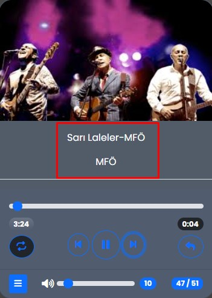


```css
  <div class="card-body">
                <div id="progress">
                    <input type="range" id="progress-bar" class="form-range">
                    <div class="times">
                        <span id="duration" class="badge rounded-pill bg-gradient">0:00</span>
                        <span id="current-time" class="badge rounded-pill bg-dark">0:00</span>
                    </div>
                </div>
```

Card içinde card-body classı içinde progress-bar oluşturduk(kırmızı dikdörtgen içindeki alan).Bu bar bana müziğin ilerleyişini gösterecek bu bar üzerinde fare ile ileri geri yaparak müziğin dakikasını üzerinde oynayabiliriz. Progress-barımızı input tagı içinde oluşturuyoruz. İnput tagı altında times classı oluşturuyoruz.Bu class içinde 2 tane span tagı oluşturuyoruz. Span tagları içinde badge, rounded-pill classlarını kullanıyoruz. Span taglarına ayrı ayrı id'ler veriyoruz .Duration id'sine sahip olan span tagları bize müziğin dakika bilgisini verecek (mavi dikdörgen içindeki alan). Current-time is'sine sahip olan span etiekti içi çalan müziğin dakika bilgisini verecek progress-barla eşzamanlı olarak çalışacak (yeşil dikdörtgen içindeki alan).

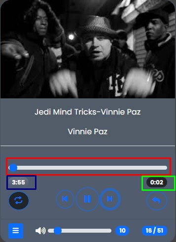

Card-body içinde controls id'si altında müzik uygulamasının kontrol butonlarını oluşturuyoruz. Bu butonlara ile müzikler arasında geçiş yapabiliriz. Müziği durdurup başlatabiliriz. Müziği başa sarabilir, ve karışık müzik çaldırabiliz. 

- Prev id'sine sahip butona tıkladığımızda bir önceki çalan müziğe geçecek,
- Next  id'sine sahip butona tıkladığımızda sonraki müziğe geçecek.
- Play id'sine sahip butona tıkladığımızda müzik çalmaya başlayacak.
- Replay id'sine sahip butona tıkladığımızda aynı müzik tekrar çalacak.

```html
 <div id="controls" class="text-center">
 <button class="btn btn-outline-primary rounded-circle float-start mt-2 "  id="repeat">
        <i class="fa-solid fa-repeat" ></i>
 </button>
 <button class="btn btn-outline-primary rounded-circle" id="prev"> 
        <i class="fa-solid fa-backward-step "></i>
 </button>
 <button class="btn btn-outline-primary rounded-circle btn-lg" id="play"> 
        <i class="fa-solid fa-play"></i>
 </button>
 <button class="btn btn-outline-primary rounded-circle" id="next">
        <i class="fa-solid fa-forward-step"></i>
 </button>
 <button class="btn btn-outline-primary rounded-circle float-end mt-2"  id="replay">
        <i class="fa-solid fa-reply" ></i>
 </button>
 </div>
```


Card-body classı altında card-footer alanımızı oluşturuyoruz. Card-footer içinde music-listesi butonumuzu oluşturuyoruz. Bu butona tıklandığında tüm müziklerin olduğu bir müzik listesi açılacak kullanıcı bu müzik listesinden istediği müziği seçebiliriz Bu butonun hemen yanında volume-container oluşturuyoruz. Volume-container içinde içinde ses ilkonu ve ses seviyesini gösteren form-range oluşturuyourz. Kullanıcı ses ikonuna tıkladığında müziğin sesini kapatıp açabilir  from-range'de tıklayarak müziğin ses seviyesini ayarlayabilir. musicSum id'si içindede müziğin toplam sayısnı ve çalan müziğin sırasını gösteren bir badge oluşturduk.

```html
 <div class="card-footer " >
  	<button class="btn btn-primary btn-sm" data-bs-toggle="collapse" data-bs-target="#music-list">
          <i class="fa-solid fa-bars"></i>
     </button>
     <div class="volume-container">
          <i id="volume" class="fa-solid fa-volume-high "></i>
          <input type="range" id="volume-bar" max="100" value="100" class="form-range">
      </div>
		<span id="musicSum">...</span>
      </div>
            <div id="music-list" class="collapse ">
                <ul class="list-group liat-group-flush">
                  
                </ul>
            </div>

        </div>
    </div>
```

Aşağıdaki resimde sol tarafta müzik listesi ve aşağısında müzik listesi gözüküyor bu ikona tıklayarak açıp kapatabiliriz. Ortada  ses ikonu ve form-range yer almakta. Sağda ise müzik-listesinde kaç şarkı olduğunu ve kaçıncı  şarkının çaldığı bilgisi veriliyor .


## Müzik Uygulaması Javascript Kodları;

Müzik uygulamasını oluştururken Musıc adlı sınıfımızı oluşturuyoruz. Bu sınıfa dışarıdan title bligisini yani şarkının başlığını, singer şarkıcı ismini, şarkının resmini ımg ve şarkı doyasını file bilgilerini alıyoruz. Const musicList adlı nesne tanımladık ve musicList içine new Music ile müzikler atıyotuz. getName adlı metod oluşturuyoruz bu metod bize şarkıyı ve şarkıcının ismini dönderecek.

```javascript
class Musıc{
    constructor(title,singer,ımg,file){
        this.title=title;
        this.singer=singer;
        this.ımg=ımg;
        this.file=file;
    }
    getName(){
        return this.title + "-" + this.singer 
    }
}
```

musıcPlayer adlı bir sınıf daha oluşturuyoruz. Bu sınıf içinde constructor ile dışarıdan bir müzik listesi alacağız. musicList'i this.musicList adlı özellik içine atacağız. this.index özelliğine'de 0 bilgisini veriyoruz. musıcPlayer içinde getMusic adlı bir fonkiyon  oluşturuyoruz Bu fonksiyon ile musicListesindeki müzikleri this.index ile alacağız.

Oluşturduğumuz tüm tagların id ve class bilgilerini alarak değişkenler içine atıyoruz.

```javascript
const container = document.querySelector(".container");
const image = document.querySelector("#music-image");
const title = document.querySelector("#music-details .title");
const singer = document.querySelector("#music-details .singer");
const play = document.querySelector("#controls #play ");
const prev = document.querySelector("#controls #prev");
const next = document.querySelector("#controls #next");
const replay = document.querySelector("#replay");
const duration = document.querySelector("#duration");
const currentTime = document.querySelector("#current-time");
const progressBar = document.querySelector("#progress-bar");
const volume = document.querySelector("#volume");
const volumeBar = document.querySelector("#volume-bar");
const ul = document.querySelector("ul") 
const musicSum = document.querySelector("#musicSum")
const repeatMusic = document.querySelector("#repeat")

```


player = new musıcPlayer(musıcList);** sınıf içindeki musicListesinini özelliklerini player adlı değişken içerisine atıyoruz. Player adlı değişken üzerinden musıcPlayer sınıfı ile içindeki musıcListesini kullanacağız.

Sayfa açıldığında bana çalan müzik bilgisini, müziği, müzik sayısını göstersin istiyorsak window'a load olayını ekliyoruz. Sayfa ilk yüklendiğinde bize müzik bilgilerini ekranda göstrecek.

```javascript
window.addEventListener('load', ()=>{
    let musıc = player.getMusıc();
    displayMusic(musıc);
    displayMusicList(player.musıcList);
    isPlayingNow();
  
   musicSayısıGöster(player.index+1,player.musıcList.length)
   
})
```

displayMusic adlı bir fonksiyon oluşturuyoruz. Bu fonkisyon bize müziğin adını, müziği söyleyen kişiyi, müzik ile ilgili resim ve müzik dosyasını gösterecek. let music diye bir değişken oluşturmuştuk bu değişken içerisine player.getMusıc() bilgilerini atamıştık. 

- musıc.getName ile müziğin adını ve müziği söyleyen şarkıcının ad bilgisini alıp title.innerText ile .title clasına sahip p etiketi içerisine atıyoruz.

  ```javascript
  const title = document.querySelector("#music-details .title");
  <div id="music-details" class="text-center  border-bottom my-3">
                  <p class="title"></p>
                  <p class="singer"></p>
              </div>
  const singer = document.querySelector("#music-details .singer");
  ```

  

- musıc.singer ile müziği söyleyen şarkıcının ismini singer.innerText ile .singer classına sahip p etiketi içerisine atıyoruz.

- "ımg/" + musıc.ımg ile müzik ile ilgili resim bilgisini alıp image.src ile music-image id'sine sahip img elemanı içerisine atıyoruz.

- "mp" + musıc.file ile müzik dosyasını audio.src değişkeni içerisine audio elamanı içerisine atıyoruz.

  Aşağıdaki resimde displayMusıc alanı tasarımsal olarak gösterilmiştir.

  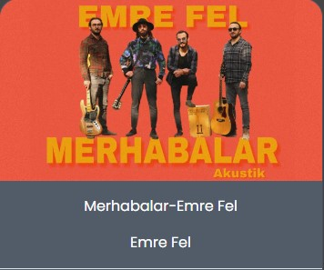

  

| 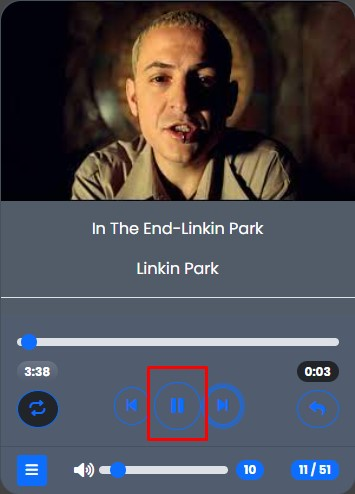 | 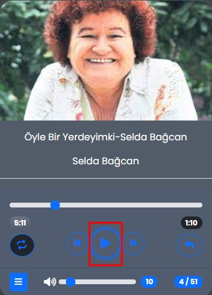 |
| ---------------------- | ---------------------- |

Yukarıda soldaki reismde kırmızı alan içindeki play ikonuna tıkladığımız da ikona sağ resimdeki icona dönecek ve müzik çalmaya başlayacak. Müzik çalıyorken sağ resimdeki kırmızı alan içindeki puse iconuna tıkladığımızda müzik duracak ve sol resimdeki icona dönecek.

```Javascript
  <button class="btn btn-outline-primary rounded-circle btn-lg" id="play"> 
     <i class="fa-solid fa-play"></i>
  </button>
    const play = document.querySelector("#controls #play ")
    const container = document.querySelector(".container");
    play.addEventListener("click", () => {
    const isMusıcPlay= container.classList.contains("playing")
    isMusıcPlay ? pauseMusic() : playMusic();
})
```

play id'sine sahip butonu play adlı değişken içerisine atıyoruz. play değişkeni üzerinden butona click olayı ekliyoruz. isMusıcPlay adlı bir değişken oluşturuyoruz. Bu değişken içerisine  container.classList.contains("playing") atıyoruz. Container classı içinde playing classını içersiyorsa müzik çalacak içermiyorsa müzik çalmayacak. isMusicPlay ile de eğer müzik çalıyorsa pauseMusic ile müziği durdur eğer çalmıyorsa playMusic ile müziği çal diyoruz. 

|  | 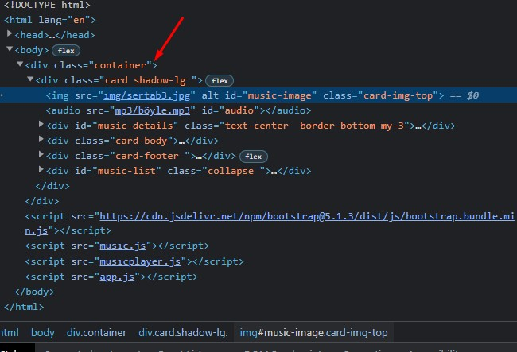 |
| ---------------------- | ---------------------- |

pauseMusic, playMusic  adlı 2  fonksiyon oluşturuyoruz. pauseMusic  tıklandığında playing classını kaldırır. play adlı değişken içerisindeki icona fa-play iconunu ekle ve auido.pause ile de müziği durdur komutlarını giriyoruz. Pause iconuna tıkladığımızda ise kırmızı okla gösterilen alanda container içinde playing classı yer almayacak.

```javascript
const pauseMusic = () =>{
    container.classList.remove("playing")
    play.querySelector("i").classList="fa-solid fa-play"
    audio.pause();  
}
const playMusic = () =>{
    container.classList.add("playing")
    play.querySelector("i").classList="fa-solid fa-pause"
    audio.play();
}
```

playMusic adlı fonsiyon içerisine ise play butonun tıkladındığıda playing classını ekle, play değişkeni  içerisindeki ikona fa-pause ikonunu ekle ve audio play ilede müziği çal komutlarını giriyoruz. 

|  | 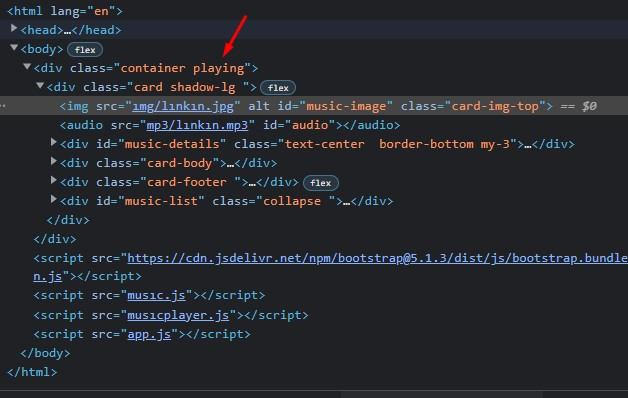 |
| ----------------------- | ----------------------- |

Yukarıdaki resiemlerde de görüldüğü gibi sol tarafta müzik çalıyorken sağ taraftaki kodların olduğu resimde de container classı içine playing classı eklenmiş şekilde gözüküyor.


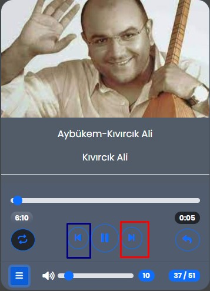

Yukarıdaki resimde işaretlenmiş olan kırmızı alan içindeki icona tıkladığımızda sonraki müziğe geçiş yapacağız.  Bunu için musıcPlayer classı içinde next fonksiyonunu tanımlıyoruz. Bu fonsiyon içinde eğer index bilgisi muziğin saysından az ise index ++ bir artarak devam edecek bir sonraki şarkıya geçiş sağlayacak. 

```javascript
   <button class="btn btn-outline-primary rounded-circle" id="next">
                        <i class="fa-solid fa-forward-step"></i>
                    </button>
const next = document.querySelector("#controls #next");
  next(){
        if(this.index + 1 < this.musıcList.length && ismixMusic === false){
            this.index++;
        }else if(this.index + 1 < this.musıcList.length  && ismixMusic === true){
            let random_index = Math.floor(Math.random() * this.musıcList.length+1)
            this.index = random_index;
        } 
        else{
            this.index=0
        }
    }

const nextMusic = () =>{
    player.next();
    let selectedMusic = player.getMusıc();
    displayMusic(selectedMusic);
    playMusic();
    isPlayingNow();
}

 musicSayısıGöster(player.index+1,player.musıcList.length)
```

next id'sine sahip butona click olayı ekliyoruz ve click olayı gerçekleştiğinde olması gerekren işlmeler için fonksiyon oluşturuyoruz. Bu fonksiyon içerisinde nextMusic adlı fonksiyonu ekliyoruzbu fonsiyon geçilen müziğin bize bilgilerini gösterecek.  musicSaysını göster fonsiyonu da bize kaçıncı müzikte olduğumuzu gösterecek.

 Mavi alan içindeki ikona tıkladığımızda prev metodu çalışacak index 0'a eşit değilse index 1 azalacak yani bir önceki şarkıya geçiş olacak. prev id'sine sahip butona click olayı ekliyoruz. Butona tıkladığımızda prevMusic fonksiyonu çalışacak ve bize çalan müziğin bilgilerini getirecek ve musicSayısnı göster fonksiyonu ile de müzik sayısını ve hangi müzikte olduğumuzun bilgisni dönderecek.

```javascript
     <button class="btn btn-outline-primary rounded-circle" id="prev"> 
         <i class="fa-solid fa-backward-step "></i>
      </button>
	const prev = document.querySelector("#controls #prev")
    prev(){
        if(this.index!=0){
            this.index--;
        }else{
            this.index=this.musıcList.length-1;
        }
        prev.addEventListener("click", () => {
    prevMusic();
    musicSayısıGöster(player.index+1,player.musıcList.length)
})
         const prevMusic = ()=>{
            player.prev()
            let musıc = player.getMusıc();
            displayMusic(musıc);
            playMusic();
            isPlayingNow();

        }
```


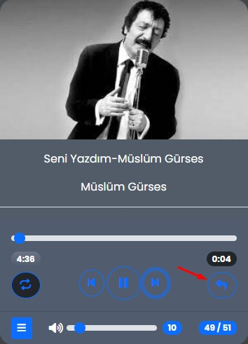

Kırmızı okla gösterilen ikona tıkladığınızda dinlediğiniz şarkıyı tekrar başa alacaktır. Müziği tekrar  başa sarması için replay fonksiyonu içinde this.index ile musicList.length == yaptım bu şekilde müziği tekrar başa alıp dinleye biliyoruz. replay id'sine sahip icona da click olayı ekliyoruz buton tıkladığımızda replayMusic fonsiyonu çalışacak bu fonsiyon kullanıcıya müzik bilgilerini aktaracak.

```javascript
  <button class="btn btn-outline-primary rounded-circle float-end mt-2"  id="replay">
      <i class="fa-solid fa-reply" ></i>
  </button>
        replay(){
        if(this.index == this.musıcList.length)
        this.index;
    }
    const replay = document.querySelector("#replay");
    replay.addEventListener("click",()=>{
 replayMusic()
musicSayısıGöster(player.index+1,player.musıcList.length)
})
const replayMusic = () =>{
    container.classList.remove("mix")
    player.replay();
    let selectedMusic = player.getMusıc();
    displayMusic(selectedMusic);
    playMusic();
    isPlayingNow();
}

```


| 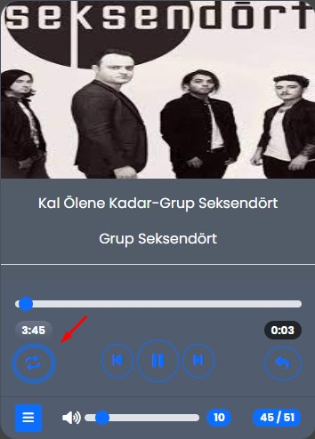 | 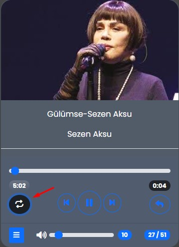 |
| ------------------------ | ------------------------ |

Kırmızı ile gösterilen ikon müziğin karışık çalmasını sağlar yukarıda soldaki resimde buton varsayılan değerinde müzikler sırasıyla çalar next butonuna bastığınızda bir sonraki şarkıya geçer. Soldaki resimde butona tıkladığında butonun rengi siyah olur şarkılar karışık çalmaya başlar next butonuna tıkladığınızda rastgele bir şarkı çalmaya başlar.  

```javascript
 <button class="btn btn-outline-primary rounded-circle float-start mt-2 "  id="repeat">
                        <i class="fa-solid fa-repeat" ></i>
 </button>

const repeatMusic = document.querySelector("#repeat")

repeatMusic.addEventListener("click",()=>{
    mixMusic()
    musicSayısıGöster(player.index+1,player.musıcList.length)
})

let ismixMusic = false;

const mixMusic = () =>{
    
        player.mixMusic();
        let rep = player.getMusıc();
        displayMusic(rep);
        playMusic();
        isPlayingNow();
        ismixMusic ? mixPause() : mixPlay();

}
const mixPause = () =>{
    ismixMusic = false
    repeatMusic.classList.remove("btn-dark")
}
const mixPlay = () =>{
    ismixMusic = true
    repeatMusic.classList.add("btn-dark")
}


```

Karışık müzik çalmak için ismixMusic adlı bir değişken tanımlıyoruz bu değişkene dışarıdan boolean türünde bir false değeri veriyoruz. **ismixMusic ? mixPause() : mixPlay();** kodu ile eğer karışık müzik çalıyorsa mixPause tıkladığımda karşık çalmayı durdursun eğer karışık müzik çalmıyorsa mixPlay tıkladığımızda karışık müzik çalsın. 

mixPause ve mixPlay adında iki fonksiyon oluşturuyoruz. mixPasue fonksiyonu içine ismixMusic= false ve   repeatMusic.classList.remove("btn-dark") komutlarını ekliyoruz. 

mixPlay fonksiyonu içine ismixMusic=true ve   repeatMusic.classList.add("btn-dark") komutllarını ekledim.

```javascript
else if(this.index +1 < this.musıcList.length  && ismixMusic === true){
            let random_index = Math.floor(Math.random() * this.musıcList.length + 1)
            this.index = random_index;
        } 
        
```

mixPause fonkssiyonu aktif iken repeat id'sine sahip  buttona tıkladığımızda mixPlay fonsiyonu aktif hale gelir ve   karışık müzik çalmaya başlar, butonun rengi siyah renge döner.  Karışık müzik aktif iken next butonuna tıkladığımızda ismixMusic === true değerine sahip müzikler karışık olarak gelmeye başlayacak. mixPlay aktif iken butona basarsak karışık müzik çalma iptal olur ve müzik varsayılan değerinde çalmaya başlar. btn-dark rengi ortadan kalkar buton varsayılan rengine geri döner.


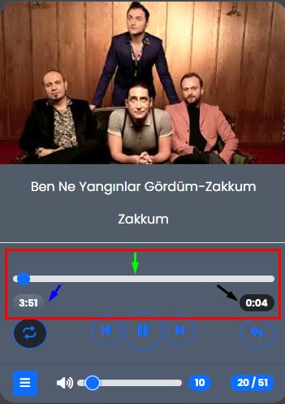

Yukarıdaki resimde kırmızı dikdörtgen alan içerisine alınan alan bize müziğin süresi hakkında bilgi veriyor. Müziğin süre bilgisini hesaplamak için ve ekrana yazdırmak için calculateTime adında bir fonksiyon oluşturuyoruz. Bu fonksiyon içerisine dışarıdan  toplamSaniye adında bir parametre ekliyoruz. Bu fonksiyon içinde müziğin dakika ve saniye bilgisini 60 dakika ve 60 saniye üzerinden hesaplıyoruz. Siyah okla gösterilen alanda bize müzik ilerledikçe müziğin anlık süresini verecek bunun için güncellenenSaniye adında bir değişken oluşturuyoruz. Bu değişken içerisinde hesaplanan saniye 10 saniyeden küçük ise 0${saniye} o yanında saniye bilgisi yazsın. Eğer 10 küçük değilse saniye bilgisi yazsın. Sonuc adlı değişken içerisine de dakika ve saniye bilgilerini ekliyoruz. 

```javascript

const calculateTime = (toplamSaniye) => {
    const dakika = Math.floor(toplamSaniye/60);
    const saniye = Math.floor(toplamSaniye % 60);
    const guncellenenSayı = saniye <10 ? `0${saniye}` : `${saniye}`;
    const sonuc = `${dakika}:${guncellenenSayı}`;
    return sonuc;
}

```

audio özeliğine loadedmetdata olayını ekliyoruz. Müzik yüklendiğinde müziğin meta verilerini almak için bu olayı kullanıyoruz. Bu olay bize müziğin boyutunu(videe), süre bilgisini verecek. Meta veriler yüklendiğinde biz duration değişkeninin textContent'ine müziğin süresini calculateTime fonksiyonu ile hesaplayarak atayacağız. progressBar değişkeni içersinede müziğin süresini Math.floor özelliği ile audio.duration üzerinden alıp atayacağız. Yukarıdaki resimde mavi okla gösterilen alanda bize hesapladığımız toplam müzik süresi gösterilecek. 

```javascript

 <div id="progress">
       <input type="range" id="progress-bar" class="form-range">
        <div class="times">
    <span id="duration" class="badge rounded-pill bg-gradient">0:00</span>
    <span id="current-time" class="badge rounded-pill bg-dark">0:00</span></div>
  </div>
const duration = document.querySelector("#duration");
const currentTime = document.querySelector("#current-time");
const progressBar = document.querySelector("#progress-bar");
```

audio özelliğine timeupdate olayı ekliyoruz. Timeupdate olayı ile ben müzik çaldıkça müziğini süre bilgisini elde edeceğiz. progrresBar.value adlı bir değişken oluşturuyoruz bu değişken içerisine audio'nun curretTime özeğini kullanarak müziğin süre bilgisini atıyoruz. calculateTime fonksiyonu ile progressBar.value içerisindeki değeri hesaplayıp currentTime değişkeninin textContenine ekliyoruz. Yukarıdaki resimde siyah okla gösterilen alanda müzik çaldıkça müziğin süre bilgisi bize gösteriliyor.

progressBar değişkeni içerisinde yer alan input'a olayı ekliyoruz. Bu input içinde bar üzerine gelip müziği ileri veya geri sarabiliriz. CurrentTime değişkenin textContentine calculate fonksiyonunu kullanarak progresBar'ın değerini hesaplayıp atıyoruz. audio'nun currenTİme özeliğine de progressbar.value atıyoruz.

```javascript

audio.addEventListener("loadedmetadata", () =>{
    duration.textContent = calculateTime(audio.duration);
    progressBar.max = Math.floor(audio.duration)
})


audio.addEventListener("timeupdate", () => {
    progressBar.value = Math.floor(audio.currentTime)
    currentTime.textContent= calculateTime(progressBar.value)
})


progressBar.addEventListener("input", () =>{
    currentTime.textContent=calculateTime(progressBar.value);
    audio.currentTime=progressBar.value;
})
```

| 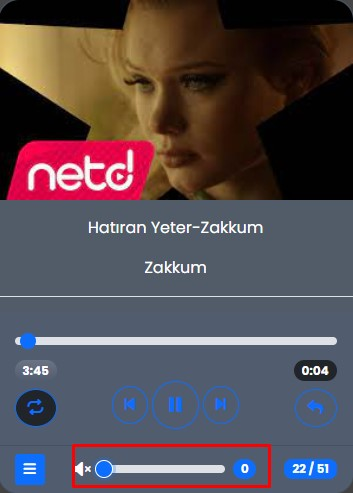 | 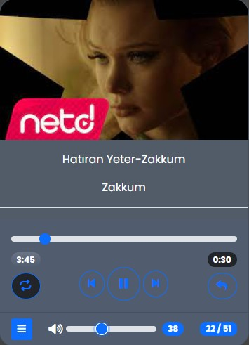 |
| ------------------------ | ------------------------ |

Yukarıda soldaki resimde kırmızı dikdörtgen içinde belirtilen sesin en son seviye de kapalı olduğu gözüküyor. Sağdaki resimde mavi dikdörtgen içinde sesin açık olduğunu görüyorsunuz. sesDurumu adlı bir değişken tanımlıyoruz. Bu değişken içerisine sessli adında bir özelik ekliyoruz.

```javascript

<div class="volume-container">
                    <i id="volume" class="fa-solid fa-volume-high "></i>
                    <input type="range" id="volume-bar" max="100" value="100" class="form-range">

                </div>
const volumeBar = document.querySelector("#volume-bar");


```

volumeBar id'sine sahip input içine addEventListener ile  input olayı ekliyoruz. Biz volum-bar id'sine sahip input üzerinde ileri geri yaptığımızda müziğin ses seviyesini ayarlayabiliyoruz. Value değişkeni tanımlıyoruz bu değişken içerisine tıkladığımızda  inputun value değerini atıyoruz eğer input üzerinde ileri geri yaptığımızda ses düzeyi değişecek. Value değişkenini volumeHigh id'sine sahip değişkeninin textContentine atıyoruz. Aşağıdaki kırmızı dikdörtgen içinde çalan şarkının  ses  düzeyi'nin 7 olduğu gösterilmiştir.

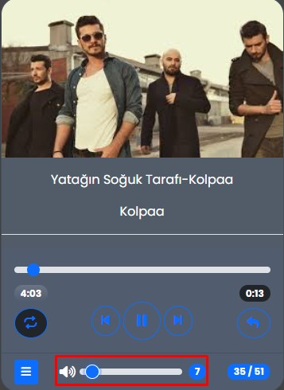

Eğer value değeri 0 eşit olduğunda audio.muted özelliği ile sesi tamamen kapatabiliyoruz. Ses Durumu sessiz oluyor. volume id'sine sahip değişkenin içine fa-volume-xmark ikonunu ekliyoruz. Eğer ses seviyesi 0'a eşit değilse audio=muted değişkenine false değerini atıyoruz. Ses durumu sessli olacak volume id'sine sahip değişkenin içerisne fa-volume-high ikonunu ekliyoruz.

Volume id'sine sahip olan icona click olayı ekliyoruz. Eğer ses durumu sessli ise audio-muted true ise ikonunun üstüne gelip tıkliyoruz ses kapanıyor. Sessin değeri 0 oluyor. audio.muted false ise ses durumu  kapalı olan ikon üstüne tıklıyoruz ve ses değeri 100  oluyor.

| 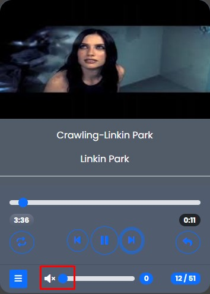 | 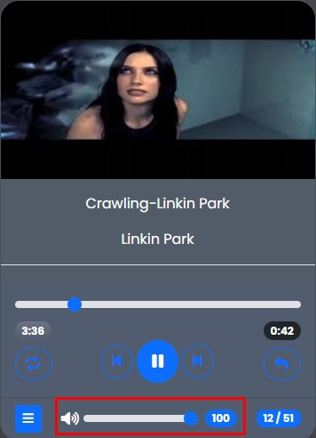 |
| ------------------------ | ------------------------ |

```javascript
  <button class="btn btn-primary btn-sm" data-bs-toggle="collapse" data-bs-target="#music-list">
                    <i class="fa-solid fa-bars"></i>
  </button>
   <div id="music-list" class="collapse ">
                <ul class="list-group liat-group-flush"> </ul>
    </div>
   const ul = document.querySelector("ul") 
```

fa-bars ikonuna sahip bir buton tanımlıyoruz. Bu butona data-bs-toggle="collapse"  özniteliğini (attribute) ekliyoruz. data-bs-target="#music-list" özniteliğini (attribute) ekliyoruz. Butonun hemen altında bir div elemaın oluşturuyour bu div'in id bilgisini butonun data-bs-targetıyla bağlıyoruz. Div'in classına da collapse özelliğni ekliyoruz. Butona tıkladığımızda bize açılı pencerede müzik listesi gelecek açılı pencere için div altında bir tane ul elemanı oluşturuyoruz. Bu elemanı içine liste elemanları ekleyeceğiz. 

displayMusicList diye fonksiyon oluturuyoruz. Bu fonksiyon dışarıdan bir tane list parametresi alacak.

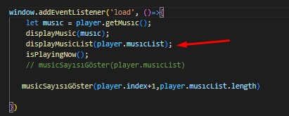

Dışarıdan gelen listenin içerindeki müzik bilgilerine for döngüsü kulanarak  liste içerisindeki müzikleri li etiketi ile listeleyeceğim. Bu li tagıiçinde müziğin adı müziğin süre bilgisi ve müzik dosyası yer almakta. Bu li etiketini liTag değişkenine atadım. Bu değişekini de ul'nın içine ekledim insertAdjacentHTML özelliğini kullanarak. 

```javascript
const displayMusicList = (list) =>{
    for(let i=0; i<list.length; i++){
let liTag=`
 <li li-index='${i}' onclick="selectedMusic(this)" class="list-group-item d-flex justify-content-between align-items-center " >
        <span >${list[i].getName()} </span>
        <span id="music-${i}" class="badge text-dark rounded-pill"></span>
        <audio class="music-${i}" src="mp3/${list[i].file}"></audio>
</li> 
`;
```

ul.querySelector(`#music-${i}`)  ile o andaki çalan müziğin süre bilgisini alıyoruz ve liAudiDuration değişkeni içerisine atıyoruz. liAudioTag içinede müziğin dosyasını attıyoruz. liAudio tag'a loadeddata olayı ekliyoruz .Bu olay gerçekleştiğinde listeden seçilen müziğin süresini calculateTime fonksiyonu ile liAudioTag içindeki müziğin süresini hesaplayıp liAudiDuration değişkeni içerisine ekleyecek.

```javascript
 ul.insertAdjacentHTML("beforeend", liTag);
      let   liAudiDuration= ul.querySelector(`#music-${i}`)
        let liAudioTag = ul.querySelector(`.music-${i}`)


        liAudioTag.addEventListener("loadeddata", () =>{

            liAudiDuration.innerText=calculateTime(liAudioTag.duration)
           
        })
    }
}
```

Li elemaı içine onclick ve li-index ekliyoruz. Bu li elemanına tıkladığımızda onclick ile oluşturduğumuz fonksiyon çalışacak.

selectedMusic adında bir fonksiyon oluşturuyoruzbu fonksiyon dışarıdan li parametresi alacak. li etiketi içinden li-index'ine sahip getAttribute alıp player.index değişkeni içerisine atıyoruz. Bu şekilde çalışacak biz listeden onclick=selectedMusic(this) ile  herhangi bir müziğe tıkladığımızda bana seçilen o müzik çalmaya başlayacak.

isPlayingNow adlı bir fonksiyon oluşturuyoruz. Bu fonksiyon çalan şarkının metin(text) rengini mavi yapacak. Fonksiyon içinde for of döngüsü ile bütün li taglarını dolaşacağız eğer li taglarının classList.contains dersek contians bize **(if(li.classList.contains("playing"))) **  true veya false değer döndürecek eğer true değer dönderirse yani li.classclistinde playing var ise li.classList.remove ile playing kaldıracağız. Li. getAtrribute ile li-index'in  player index'e eşitse li'nin classlistine o zaman playing clasını eklesin.

```javascript
li.playing{
    background-color: #0b5eb7;
    color: #fff;
    cursor: pointer;
    font-weight:bolder ;
    box-shadow: 4px 4px 4px slateblue;

}
 const isPlayingNow = () =>{
    for(let li of ul.querySelectorAll("li")){
        if(li.classList.contains("playing")){
            li.classList.remove("playing")
        }
        if(li.getAttribute("li-index")==player.index){
            li.classList.add("playing")
           

        }
        }
```

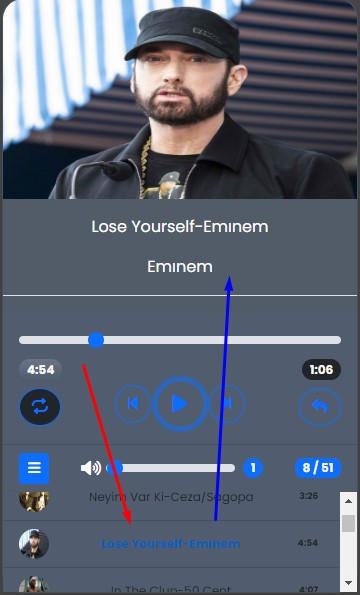

Çalan müzik bitiğinde sonraki müziğe geçerken rastgele bir şarkıya geçsin bunun içinde audi özeliğine ended olayını ekliyoruz. Müzik bitiğinde rastgele başka bir müziğe geçiş yapacak.

```javascript
    audio.addEventListener("ended",() =>{
        
        mixMusic()
        musicSayısıGöster(player.index+1,player.musıcList.length)
     
      })
```

musicSayısıGöster diye bir fonksiyon oluşturuyoruz. Bu fonksiyon bize toplam müzik sayısını ve çalan müziğin sıra bilgisini verecek. Aşağıdaki resimde kırmızı dikdörtgen içindeki alanda müzik sayısı gösterilmektedir. Mavi okla gösterilen yerde müziğin sırası yeşil okla gösterilen alanda ise toplam müzik sayısı gösterilmektedir.

 musicSayısıGöster fonksiyonu içerisine dışarıdan parametre gireceğiz. Müzik sırasını player.index+1 ile alacağız. Toplam müzik sayısını da player.musıcList.length ile alacağız.

```javascript
      const musicSayısıGöster = (musicSırası,toplamMusic) =>{
                   let sıra=`<span class='badge bg-primary float-end  text-light' style="border-radius:8px; ">${musicSırası} / ${toplamMusic}</span>`;
             musicSum.innerHTML = sıra
                 
      }
          musicSayısıGöster(player.index+1,player.musıcList.length)
```

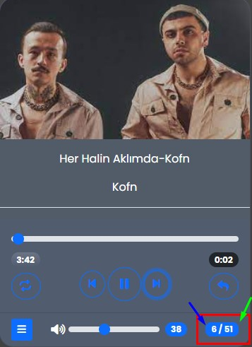

